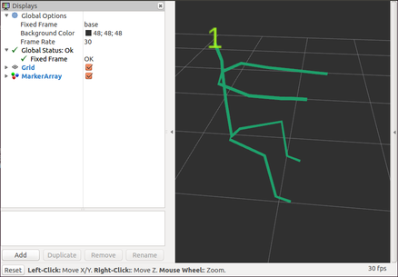

# rviz_skeleton_visualization
Demonstration of Skeleton visualization in RVIZ

## Package Dependencies
1. [rviz](http://wiki.ros.org/rviz): It is used for visualization
1. [kinect_anywhere](https://github.com/ravijo/kinect_anywhere): It is used to obtain Kinect data for real time visualization. No need to install if you don't want to run `realtime_visualization.launch`

## Steps to compile
1. Make sure to download complete repository. Use `git clone` or download directory as per convenience
1. Invoke `catkin` tool while inside ros workspace i.e., `catkin_make`
1. Make the scripts executable by running following commands-
     1. [visualization.py](scripts/visualization.py): `chmod +x ~/ros_ws/src/rviz_skeleton_visualization/scripts/visualization.py`
     1. [realtime_visualization.py](scripts/realtime_visualization.py): `chmod +x  ~/ros_ws/src/rviz_skeleton_visualization/scripts/realtime_visualization.py`

In above commands, please note that ROS workspace is located inside` $HOME`. You may have to change the above command accordingly.

## Steps to run
There are following two examples to run in this package.
1. **Recorded Skeletion Visualization**: Simply invoke `visualization.launch` i.e., `roslaunch rviz_skeleton_visualization visualization.launch`
1. **Realtime Skeletion Visualization**: Please follow below steps-
     1. Make sure package dependency [kinect_anywhere](https://github.com/ravijo/kinect_anywhere) is configured properly and running
     1. Invoke `realtime_visualization.launch` i.e., `roslaunch rviz_skeleton_visualization realtime_visualization.launch `

## Issues
Please check [here](https://github.com/ravijo/rviz_skeleton_visualization/issues) and create issues.
